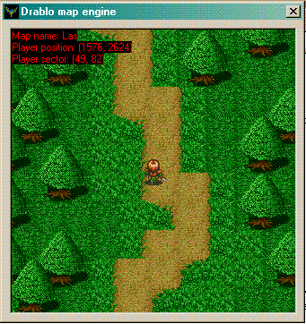



## Drablo Map System

### Description

A RPG map engine from my game which is called "Drablo". www.Drablo.up.pl (polish only but you can see the gallery here: http://www.vviktor.dotgeek.org/Drablo/index.php?dzial=3).
 
### More Info
 

             |
---                |---
**Submitted On**   |2005-11-20 14:49:28
**By**             |[vViktor](https://github.com/Planet-Source-Code/PSCIndex/blob/master/ByAuthor/vviktor.md)
**Level**          |Intermediate
**User Rating**    |5.0 (10 globes from 2 users)
**Compatibility**  |VB 5\.0, VB 6\.0
**Category**       |[Games](https://github.com/Planet-Source-Code/PSCIndex/blob/master/ByCategory/games__1-38.md)
**World**          |[Visual Basic](https://github.com/Planet-Source-Code/PSCIndex/blob/master/ByWorld/visual-basic.md)
**Archive File**   |[Drablo\_Map1969091312006\.zip](https://github.com/Planet-Source-Code/vviktor-drablo-map-system__1-64187/archive/master.zip)

